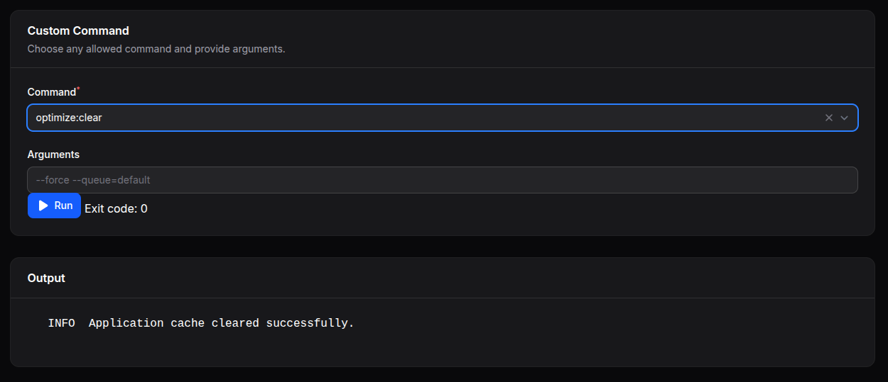

# Filaforge System Packages

A Filament ## Usage

After installation and registration, you'll find the "Composer Packages" resource in your Filament panel navigation. The plugin provides:

- **Package List**: Comprehensive list of all installed Composer packages
- **Search & Filter**: Find specific packages quickly
- **Version Information**: View current versions and requirements
- **Dependency Details**: Explore package dependencies
- **License Information**: Check package licenses and compliance

Navigate to your Filament panel and look for "Composer Packages" in the sidebar to explore your project's dependencies.

## Configuration

No additional configuration is required. The plugin automatically reads your `composer.lock` file.

## Features

- ✅ Complete Composer package listing
- ✅ Advanced search and filtering
- ✅ Version and dependency tracking
- ✅ License compliance checking
- ✅ Clean, organized interface
- ✅ Auto-refreshing package data

---

**Package**: `filaforge/system-packages`  
**License**: MIT  
**Requirements**: PHP ^8.1, Laravel ^12, Filament ^4.0nel plugin that lists installed Composer packages in a searchable, paginated table.



## Requirements
- PHP >= 8.1
- Laravel 12 (illuminate/support ^12)
- Filament ^4.0

## Installation

### Step 1: Install via Composer
```bash
composer require filaforge/system-packages
```

### Step 2: Service Provider Registration
The service provider is auto-discovered, so no manual registration is required.

### Publish (optional)
```bash
php artisan vendor:publish --provider="Filaforge\\SystemPackages\\Providers\\SystemPackagesServiceProvider"
```

### Step 4: Register the plugin in your panel
```php
use Filaforge\SystemPackages\SystemPackagesPlugin;
use Filament\Panel;

public function panel(Panel $panel): Panel
{
    return $panel
        // ...
        ->plugin(SystemPackagesPlugin::make());
}
```

## Troubleshooting

- Publish provider (if assets/config available) and clear caches:
```bash
php artisan vendor:publish --provider="Filaforge\\SystemPackages\\Providers\\SystemPackagesServiceProvider" || true
php artisan optimize:clear
```
- Check logs for errors:
```bash
tail -f storage/logs/laravel.log
```

## Uninstall

1) Remove the panel plugin registration:
```php
// remove ->plugin(\\Filaforge\\SystemPackages\\SystemPackagesPlugin::make())
```
2) Remove the package and clear caches:
```bash
composer remove filaforge/system-packages
php artisan optimize:clear
```

## Usage
- Navigate to the Composer Packages resource in your panel navigation.
- A legacy “System Packages” page is provided and redirects to the resource automatically.

---
Package: `filaforge/system-packages`
